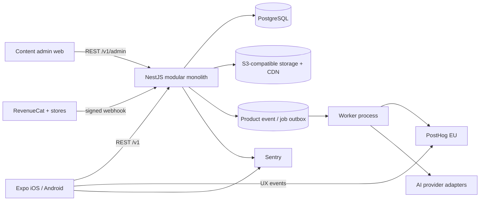
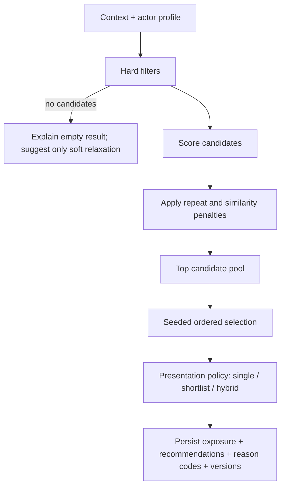
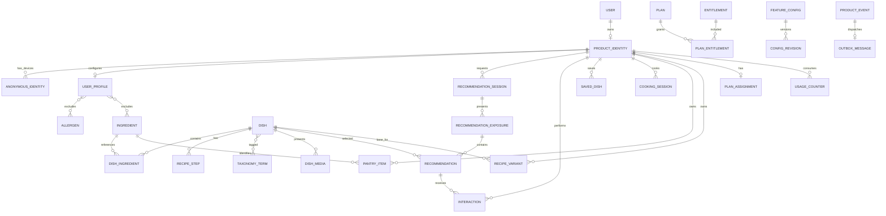

# Target product architecture

Status: Accepted

Review cadence: before each beta milestone

## 0. Product constraint on architecture

The system optimizes for a completed, trusted meal decision, not catalog engagement. Feature
breadth is not a defensible architecture boundary: planning, Pantry, AI generation/adaptation and
photo input already exist in competing products. The initial product wedge is speed, situational
fit, explainability and verified content.

The decision engine and the presentation policy are separate. Ranking always produces an ordered
candidate set; a versioned server policy exposes one recommendation, a shortlist of two or three,
or a hybrid. The founder-selected working policy is Hybrid: position 1 is the dominant answer and
positions 2-3 are quieter alternatives with factual benefit/cost comparisons. Stage 0 validates
that direction and preserves Single/Shortlist rollback modes. Feed/search is not the default core
architecture.

## 1. Technology stack

| Area                 | Decision                                                                     | Notes                                                                                               |
| -------------------- | ---------------------------------------------------------------------------- | --------------------------------------------------------------------------------------------------- |
| Monorepo             | npm workspaces, TypeScript, GitHub Actions                                   | Retain. Add Turborepo only when build time warrants it.                                             |
| Runtime              | Pin Node 20.19.4 now; qualify Node 24 LTS in a separate upgrade PR           | Do not mix runtime upgrade with product migrations.                                                 |
| Mobile               | Expo + React Native + TypeScript                                             | Retain. Upgrade Expo 54 one SDK at a time to the current supported SDK before store release.        |
| Mobile routing       | Expo Router                                                                  | File-based routes, typed deep links, thin route files.                                              |
| Server state         | TanStack Query                                                               | Cache, retries, invalidation, offline-aware request state.                                          |
| Local state          | Zustand                                                                      | Onboarding draft, active context, UI state; never duplicate server entities.                        |
| Forms                | React Hook Form + Zod                                                        | Shared validation semantics and accessible errors.                                                  |
| Local persistence    | SecureStore for credentials; SQLite for durable product/cache data           | Do not store tokens in AsyncStorage.                                                                |
| API                  | NestJS modular monolith, REST `/v1`, Zod contracts                           | Retain; add OpenAPI output for external/admin consumers.                                            |
| Data access          | Prisma + PostgreSQL 16                                                       | Retain current production baseline. Use SQL where ranking queries require it.                       |
| Jobs/cache           | PostgreSQL outbox first; Redis + BullMQ when AI/photo jobs ship              | Avoid operating Redis before a queue/cache use case exists.                                         |
| Object storage       | S3-compatible bucket (Cloudflare R2 or OCI Object Storage) + CDN             | Signed upload URLs, lifecycle policy, no images in DB.                                              |
| Product analytics    | PostHog Cloud EU                                                             | Explicit custom events, feature experiments, funnels, retention. Autocapture is supplementary only. |
| Reliability          | Sentry for mobile and API; structured JSON logs with request/correlation IDs | Release, environment, actor-safe tags; never send allergy/free-text secrets.                        |
| Subscriptions        | RevenueCat when payment exit criteria are met                                | Store webhooks update server-side subscription state; backend remains authorization source.         |
| Mobile E2E           | Maestro on built binaries                                                    | One cross-platform black-box suite, stable `testID` selectors.                                      |
| API/load/security QA | Jest/Supertest, Testcontainers, k6, OWASP ZAP                                | CI gates scale by release risk.                                                                     |
| Design               | Figma Variables + component library; versioned tokens in Git                 | Figma for interaction specs; code tokens are reviewed in PRs.                                       |

Official implementation references:

- [Expo SDK upgrade process](https://docs.expo.dev/workflow/upgrading-expo-sdk-walkthrough/)
- [Expo Router](https://docs.expo.dev/router/introduction/)
- [PostHog React Native SDK](https://posthog.com/docs/libraries/react-native)
- [Sentry with Expo](https://docs.sentry.io/platforms/react-native/manual-setup/expo/)
- [RevenueCat with Expo](https://www.revenuecat.com/docs/getting-started/installation/expo)
- [Maestro for React Native](https://docs.maestro.dev/platform-support/react-native)

## 2. Runtime topology



For beta, API and worker may be two processes from the same codebase and image. Separate services
or repositories are not justified until independent scaling or ownership is demonstrated.

## 3. Backend boundaries

Each module owns its controllers, application use cases, domain rules, persistence ports, and
tests. Modules may call another module's public application service; they must not query another
module's tables through its repository.

```text
apps/api/src/
  app/
    bootstrap/                 configuration, global filters, observability
  modules/
    identity/                  guest identity, account linking, merge
    auth/                      credentials and sessions
    profiles/                  diet, allergies, exclusions, goals, equipment
    catalog/                   dishes, ingredients, recipes, taxonomy, media
    recommendations/           sessions, filters, scoring, selection, explanation
    interactions/              rejection and behavioral feedback
    saved/                     favorites, cook-later, custom versions
    cooking/                   cooking sessions and history
    pantry/                    pantry and matching
    ai-adaptation/             variants, prompts, validation, cost
    entitlements/              plans, feature access, usage limits
    configuration/             flags and server-owned weights
    analytics/                 event schema and transactional outbox
    admin/                     RBAC content operations
  infrastructure/
    prisma/ posthog/ sentry/ storage/ revenuecat/ ai/
```

Request path:

```text
Controller -> application command/query -> domain policy -> repository port -> Prisma adapter
```

Controllers validate transport contracts only. Dietary safety, idempotency, entitlement limits,
and ranking rules live in domain/application services and are tested without HTTP.

## 4. Recommendation architecture

`POST /v1/recommendations` accepts an `Idempotency-Key`. It creates or reuses a recommendation
session, evaluates hard filters, scores candidates, creates a seeded ordered top pool, applies the
session's presentation policy, persists an exposure containing one to three recommendations and
emits outbox events in one transaction.



Hard filters are fail-closed: diet, allergens, permanent exclusions, explicit ingredient bans,
and critical equipment. A data-quality uncertainty that can violate a hard constraint excludes
the dish. Soft filters may only be relaxed after explicit user confirmation.

The initial score is configuration-driven:

```text
0.35 context fit
0.25 learned / explicit preference fit
0.15 pantry coverage
0.10 repeat avoidance
0.10 content quality
0.05 exploration
```

Persist the component scores, final score, reason codes, candidate-pool size, random seed, config
version, algorithm version, presentation mode and ordered exposure membership. This makes every
decision reproducible and makes simultaneous shortlist views distinguishable from sequential
`Another` requests.

For Hybrid exposures, compute alternative tradeoffs against position 1 from normalized structured
facts. Persist a typed comparison code, direction, numeric delta, unit and reference result. The
client localizes the label; the server never invents subjective health claims.

The client cannot request an arbitrary result count. Stable experiment assignment and server
configuration select the presentation policy so that metrics and rollback remain trustworthy.
Safety filters and candidate scores are identical across presentation variants.

## 5. Mobile architecture

```text
apps/mobile/
  app/                         Expo Router files; no business logic
  src/app/                     providers, bootstrap, navigation analytics
  src/features/
    onboarding/ home/ filters/ recommendation/ rejection/
    recipe/ cooking/ saved/ pantry/ profile/ auth/ paywall/
  src/entities/                dish, ingredient, actor, entitlement
  src/shared/
    api/ analytics/ config/ i18n/ storage/ ui/ theme/ testing/
```

Rules:

- TanStack Query owns remote state. Zustand owns only cross-screen local state.
- Route components compose features; they do not call `fetch` directly.
- API DTOs are parsed through shared Zod contracts at the boundary.
- Every user-facing string is an i18n key from the first migrated screen.
- Every network screen implements loading, empty, error, offline, retry, and stale-data states.
- `testID`, accessibility label, role, state, and hint are part of component contracts.
- The preferred Hybrid view and Single/Shortlist rollback modes consume the same exposure contract
  and shared card primitives; launch configuration is server-owned.
- The old Random/Manage shell remains behind `legacy_mvp` until the new flow reaches parity.

## 6. Identity and account merge

Guest use is first-class. A stable random `anonymousId` is created locally and sent on every
request. The server maps it to a product identity. A product identity can later be linked to a
`User`, and multiple anonymous device identities may map to the same product identity.

Account linking is a transaction:

1. lock guest and account identities;
2. move recommendation, interaction, saved, cooking, pantry, and usage records using documented
   conflict rules;
3. attach the anonymous device identity to the account identity;
4. mark the guest identity as merged;
5. alias/identify the user in analytics without changing historical event IDs.

## 7. Target data model

Existing CUID identifiers remain valid. New IDs should use the same strategy during migration;
changing all IDs to UUID provides no product value and creates unnecessary data risk.



### Catalog fields

`Dish` gains publication status, source/visibility, meal types, total/prep/cook time, difficulty,
servings, nutrition per serving plus confidence/source, quality score, verification timestamps,
and content version. Ingredients become canonical `Ingredient` records with aliases, category,
diet flags, allergen links, and optional nutrition reference data. `DishIngredient` keeps numeric
quantity, normalized unit, optional/group fields, preparation note, and substitutions.

Published dishes must pass a database-independent `PublishDishPolicy`. Incomplete or unverified
dishes never enter the recommendation pool.

### Operational entities

- `RecommendationSession`: actor, immutable context snapshot, algorithm/config versions,
  presentation assignment, idempotency key, state, timestamps.
- `RecommendationExposure`: session, sequence, presentation mode, results shown and shown time.
- `Recommendation`: exposure, dish, position, component scores, final score, rank, reason codes,
  pool size, seed and accepted timestamp.
- `Interaction`: actor, recommendation, dish, typed action/reason, context snapshot.
- `RecipeVariant`: immutable base dish version, structured recipe, prompt/model versions,
  validation report, acceptance status and AI cost.
- `UsageCounter`: actor + entitlement + UTC period, used/reserved values, unique composite key.
- `ProductEvent`: canonical server event with unique event ID and privacy-reviewed properties.
- `OutboxMessage`: destination, payload, attempts, next attempt and delivery timestamp.

## 8. Migration rules

Use expand/migrate/contract:

1. add nullable columns/tables and dual-write;
2. backfill in bounded, restartable batches with checkpoints;
3. compare old/new reads and publish a reconciliation report;
4. switch reads behind a server flag;
5. retain old fields for at least one production release;
6. remove only after rollback window and backup verification.

Never edit an applied migration. Every data backfill has dry-run mode, counts before/after, and a
production backup/restore rehearsal. AI never updates canonical recipes in place.

## 9. API conventions

- Prefix product endpoints with `/v1`; keep legacy routes until mobile migration is complete.
- RFC 7807-compatible problem responses with stable `code` and localized client copy.
- Cursor pagination; ISO-8601 UTC timestamps; explicit units.
- `Idempotency-Key` on recommendations, interactions, cooking transitions, AI requests and usage.
- `X-Request-Id`, `X-Anonymous-Id`, app version, platform and locale headers.
- Optimistic concurrency (`version` or `updatedAt`) for recipe/profile edits.
- Server validates entitlement and hard dietary constraints on every protected operation.

## 10. Security and privacy baseline

- Argon2id password hashes; rotating opaque sessions retained until OAuth is justified.
- RBAC roles `user`, `content_editor`, `content_reviewer`, `admin`; no shared write token for admin.
- Rate limits by identity and IP, stricter for auth, AI, uploads and recognition.
- Signed uploads, MIME/magic-byte validation, size limits, malware scanning where applicable.
- Data deletion job covers primary DB, object storage, analytics deletion request and backups policy.
- Allergy and health-adjacent data are sensitive product data: minimize, encrypt in transit/at
  rest, exclude from logs/replay, and document purpose/retention.
- Secrets use a secret manager or GitHub environment secrets; production database should move to
  managed PostgreSQL before public scale makes single-VM recovery risk unacceptable.
